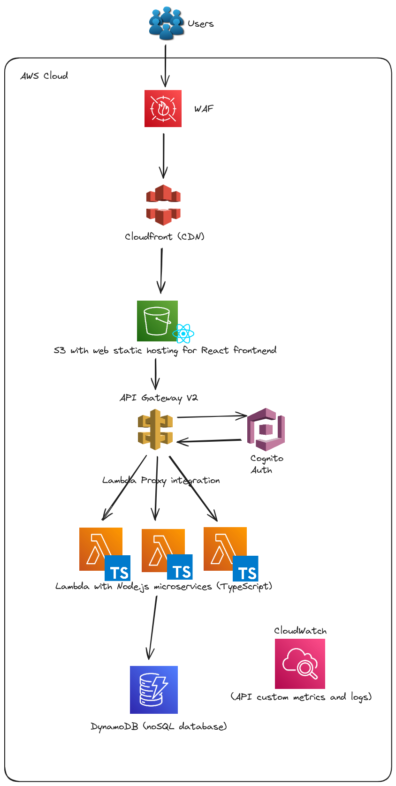
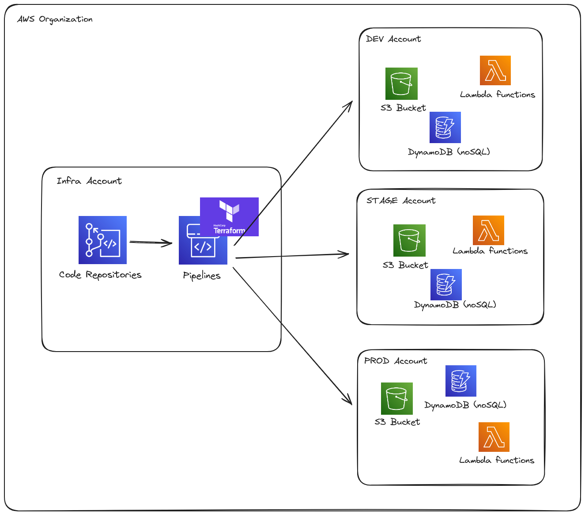
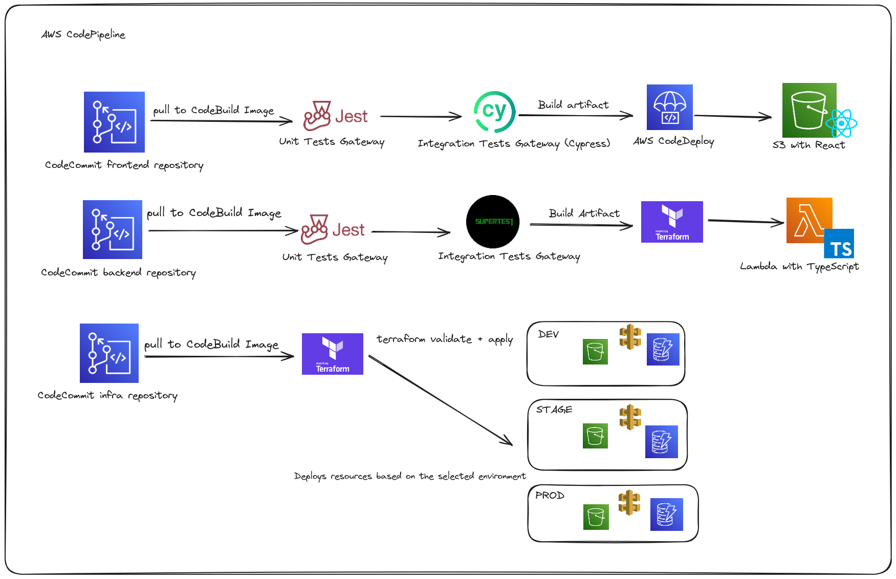
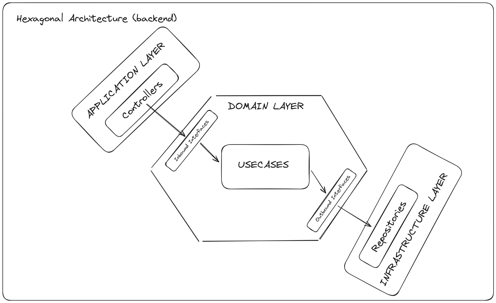

# Architecture Diagrams

## Learning Management System Project

This project was the largest I have ever been a part of; however, my involvement in the architectural decisions was limited. My primary responsibilities included developing code and creating metrics in CloudWatch.

This project was developed to create an educational platform where students and teachers could interact. The platform registered over one million users, with peaks of up to 100,000 simultaneous users. The technologies used were React for the frontend, Node.js for the microservices, and MySQL for data storage. The architecture was based on the AWS 3-tier model (Presentation/Application/Database).

The **Presentation Layer** includes an Amazon Web Application Firewall (WAF) to protect against common web threats, an Application Load Balancer (ALB) to distribute incoming traffic among EC2 instances, and Auto Scaling Groups (ASGs) for React servers that adjust the number of instances based on demand. The **Application Layer** features API Gateway V2 for managing and routing API requests, Amazon Cognito for user authentication and authorization, and ASGs for Node.js microservices to handle workload variations. Additionally, Amazon CloudWatch monitors custom metrics and logs for proactive problem detection. The **Database Layer** utilizes Amazon RDS (MySQL) for secure, scalable, and highly available data storage, configured in a cluster with replicas across multiple availability zones to ensure resilience and performance.

The CI/CD pipeline for this project is implemented using Azure DevOps, ensuring a streamlined and automated process for code integration and deployment. The pipeline begins with pulling the latest code from the Git repository. Once the code is retrieved, it undergoes static code analysis using SonarQube to identify potential code quality issues and security vulnerabilities. After passing the code quality checks, unit tests are executed to verify the functionality of individual components. Following successful unit testing, integration tests are conducted to ensure that the components work together as expected. Finally, if all tests pass, the code is deployed to the target environment, completing the continuous integration and continuous deployment process.

## Energy Cost Savings Simulator Project

In this project, I actively participated in the architectural decisions and the selection of technologies to be used. The project involved developing a platform for the marketing team of a renewable energy company to generate energy savings proposals for their clients.

With this implementation, I reduced the time required to generate and send proposals to clients—from 15 days using a spreadsheet to just 20 minutes, depending on the number of simulations performed by the operator.

### Architecture

In the **Presentation Layer**, users interact with the application through an interface protected by the Amazon Web Application Firewall (WAF), which mitigates common web threats. The content is delivered by Amazon CloudFront (CDN), which distributes the content globally and caches the pages. The static files for the React frontend are hosted on Amazon S3, as good SEO was not a requirement for the platform.

In the **Application Layer**, the Amazon API Gateway V2 acts as the entry point for all API requests, managing and routing calls to the microservices. User authentication and authorization are handled by Amazon Cognito. The microservices are implemented with AWS Lambda using Node.js with TypeScript, ensuring automatic scalability without the need for server management. These microservices process the requests and interact with other components as needed. I adopted an architecture based on serverless functions because there was no need for a 24/7 server to handle the demands, and it was worthwhile not to worry about backend server management for this project since we needed an MVP quickly.

The **Database Layer** is composed of Amazon DynamoDB, a high-performance NoSQL database that offers scalability and low latency, supporting the microservices operations. I chose this model because the entity contracts were not defined at the beginning, and for starting the MVP, a NoSQL database was worthwhile due to its flexibility. For monitoring and custom API logs, the architecture uses Amazon CloudWatch, allowing observation of the application's health and proactive problem detection.

### Environments

I separated the environments into four distinct categories to better organize and manage responsibilities and permissions. One account is designated for storing the code base and pipelines, while the other three environments are used solely for receiving resources created by Terraform, such as DynamoDB, Lambda Functions, API Gateway, and S3.

### CI/CD

Regarding the CI/CD process, I created distinct pipelines for each environment, each with its own processes, including a manual approval step for deploying to production.

### Code

Regarding the code, I established the backend standards, where I have more experience. I utilized hexagonal architecture with SOLID principes to set the coding standards, combined with TypeScript, to ensure the team adheres to a consistent pattern.

