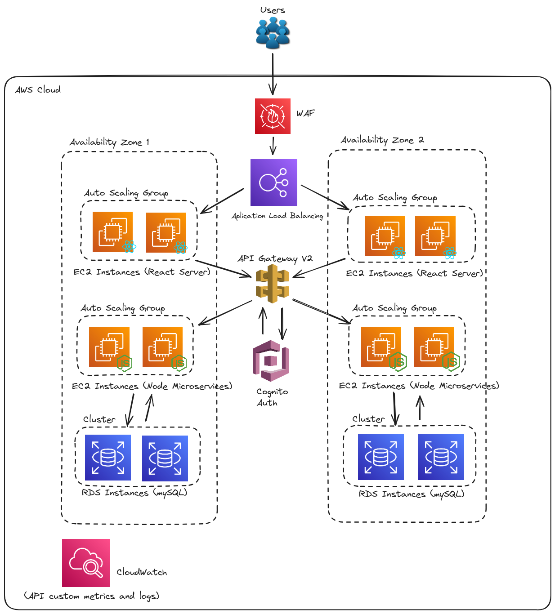
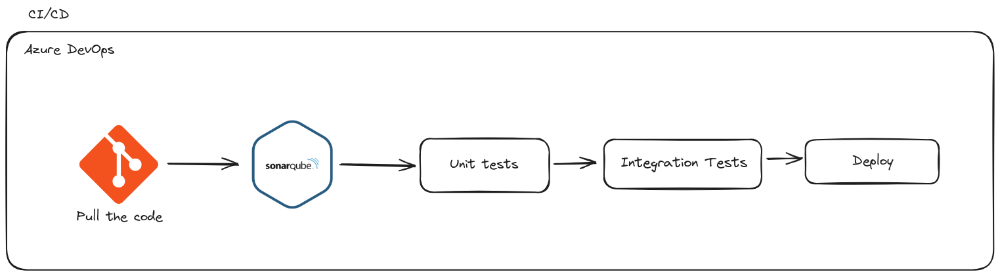

# Learning Management System Project

This project was the largest I have ever been a part of; however, my involvement in the architectural decisions was limited. My primary responsibilities included developing code and creating metrics in CloudWatch.

This project was developed to create an educational platform where students and teachers could interact. The platform registered over one million users, with peaks of up to 100,000 simultaneous users. The technologies used were React for the frontend, Node.js for the microservices, and MySQL for data storage. The architecture was based on the AWS 3-tier model (Presentation/Application/Database).

The **Presentation Layer** includes an Amazon Web Application Firewall (WAF) to protect against common web threats, an Application Load Balancer (ALB) to distribute incoming traffic among EC2 instances, and Auto Scaling Groups (ASGs) for React servers that adjust the number of instances based on demand. The **Application Layer** features API Gateway V2 for managing and routing API requests, Amazon Cognito for user authentication and authorization, and ASGs for Node.js microservices to handle workload variations. Additionally, Amazon CloudWatch monitors custom metrics and logs for proactive problem detection. The **Database Layer** utilizes Amazon RDS (MySQL) for secure, scalable, and highly available data storage, configured in a cluster with replicas across multiple availability zones to ensure resilience and performance.

The CI/CD pipeline for this project is implemented using Azure DevOps, ensuring a streamlined and automated process for code integration and deployment. The pipeline begins with pulling the latest code from the Git repository. Once the code is retrieved, it undergoes static code analysis using SonarQube to identify potential code quality issues and security vulnerabilities. After passing the code quality checks, unit tests are executed to verify the functionality of individual components. Following successful unit testing, integration tests are conducted to ensure that the components work together as expected. Finally, if all tests pass, the code is deployed to the target environment, completing the continuous integration and continuous deployment process.
